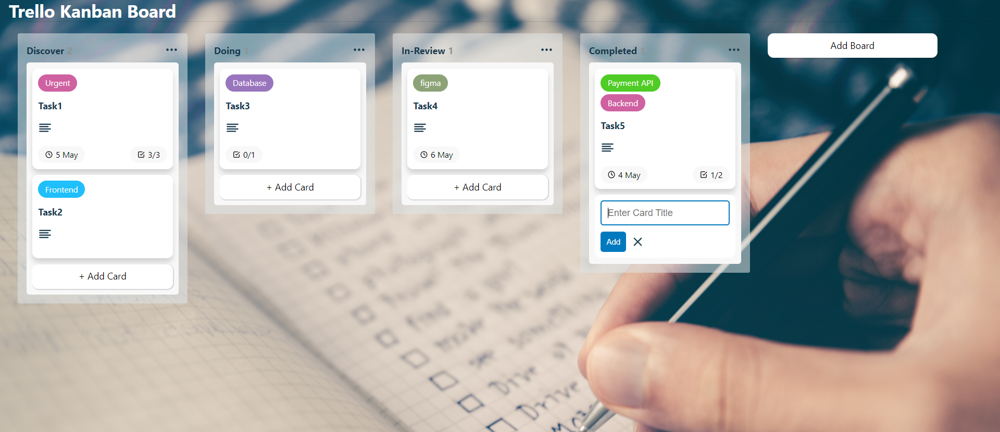
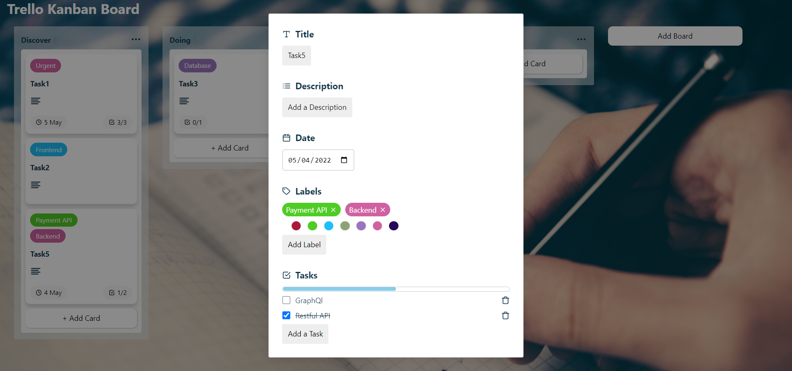

# TrelloKanban

Trello Board developed using React JS, React Feather, Local Storage and TypeScript where users can Manage Tasks.

## Snapshots

# `Home/Dashboard Page`

# `Task Management`

## Installation and Setup Instructions

Install Node JS on your machine.

Install Pre-requisite Packages:

`npm install`

To start your app in local server:

`npm start`

To Visit App Via Browser:

`http://localhost:3000`
